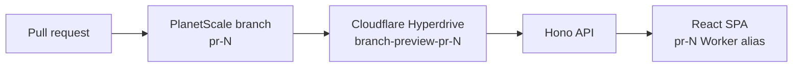

# Full-stack branch previews on Cloudflare + PlanetScale

Reactの画面とHono APIを1つのCloudflare Workerに載せ、PRごとにPlanetScaleの独立ブランチとCloudflare Hyperdriveを用意する最小サンプルです。メモを追加すると、ブラウザからHono APIを経由し、PR専用のPlanetScaleブランチへ保存されます。



## ローカル確認

Node.js 24で次を実行します。

```sh
npm ci
npm run check
```

`npm run dev` で画面は起動できます。DB APIの実行にはHyperdrive bindingが必要なため、DBを含む確認はCloudflare上のPRプレビューで行います。

## PRプレビューのライフサイクル

`.github/workflows/branch-preview.yml` が次を自動化します。

1. PR番号に対応するPlanetScaleブランチ `pr-N` を `main` から作成
2. そのブランチ専用のDB資格情報を作成
3. 資格情報をCloudflare Hyperdrive `branch-preview-pr-N` に登録
4. ReactとHonoを同じWorker versionへアップロードし、`pr-N` の固定プレビューURLを発行
5. UI、Hono health API、Hyperdrive経由のDBクエリをsmoke test
6. PRを閉じたらHyperdriveとPlanetScaleブランチを削除

同じPRを更新した場合、PlanetScaleブランチのデータは維持しつつ、資格情報・Hyperdrive・Worker versionだけを更新します。Hyperdriveのクエリキャッシュは、書き込み直後の表示を確実にするため無効です。

## GitHub設定

Actions secrets:

- `CLOUDFLARE_API_TOKEN`: ken12で始まるCloudflareアカウントに対する Workers Scripts Edit と Hyperdrive Edit 権限
- `PLANETSCALE_SERVICE_TOKEN_ID`
- `PLANETSCALE_SERVICE_TOKEN`: 対象DBへの `create_branch`、`read_branch`、`delete_branch`、`connect_branch`、`delete_branch_password` 権限

Actions variables:

- `PLANETSCALE_ORG_NAME`
- `PLANETSCALE_DATABASE_NAME`

Cloudflare account IDはken12で始まるログインの `77d31ec7cf644c489ff4a05f71d9eefb` に固定しています。PlanetScale側はVitess/MySQLデータベースと `main` ブランチを前提にします。`notes` テーブルはプレビューの初回アクセス時に作られ、同じDDLを [migrations/001_create_notes.sql](migrations/001_create_notes.sql) にも保持しています。

外部forkのPRではリポジトリsecretsを安全に渡せないため、プレビュージョブは同一リポジトリ内のPRだけを対象にします。
