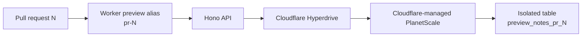

# Cloudflare-only full-stack branch previews

Reactの画面とHono APIを1つのCloudflare Workerへ載せ、Cloudflare管理のPlanetScale MySQLへHyperdrive経由で接続する最小サンプルです。PlanetScaleのログインやservice tokenは使いません。



## DBを含むプレビュー分離

Cloudflareから作成した1つのPlanetScale databaseとHyperdriveを共有し、PR番号から作る検証済みnamespace `pr_N` ごとに専用テーブル `preview_notes_pr_N` を作成します。Workerには自分のnamespaceだけを渡すため、別PRのデータへ到達できません。同じPRへのpushではデータを維持し、PRを閉じると認証済みcleanup APIが専用テーブルを削除します。

PlanetScale固有のAPI認証をCIへ持ち込まず、CloudflareのWorker、Hyperdrive、PlanetScale請求をken12で始まる同一アカウントに集約する構成です。

## 初回Cloudflare設定

1. Cloudflare Dashboardの [PlanetScale database作成画面](https://dash.cloudflare.com/?step=1&to=%2F%3Aaccount%2Fworkers%2Fhyperdrive%3Fmodal%3D1&type=planetscale) からMySQL databaseを作成します。
2. 作成フローで接続されたHyperdrive configuration IDを、GitHub Actions variable `CLOUDFLARE_PLANETSCALE_HYPERDRIVE_ID` に保存します。
3. 対象accountだけに絞ったCloudflare API tokenを、Actions secret `CLOUDFLARE_API_TOKEN` に保存します。Worker versionのuploadに必要な `Workers Scripts: Edit` と、binding確認用の `Hyperdrive: Read` を付けます。
4. cleanup用のランダム値をActions secret `PREVIEW_CLEANUP_TOKEN` に保存します。これはCloudflareへWorker secretとして暗号化uploadされます。

```sh
openssl rand -hex 32 | gh secret set PREVIEW_CLEANUP_TOKEN
```

Cloudflare account IDは `Ken1251213@gmail.com's Account` の `77d31ec7cf644c489ff4a05f71d9eefb` に固定しています。Cloudflareから作成したPlanetScale databaseはCloudflare請求となり、databaseが存在する間は利用有無にかかわらず料金が発生します。

## PRプレビューのライフサイクル

`.github/workflows/branch-preview.yml` は同一repositoryのPRに対して次を実行します。

1. lint、unit test、TypeScript/Vite build、Wrangler dry-run
2. ReactとHonoを同じWorker versionへupload
3. PR番号に対応する固定alias URL `pr-N-branch-preview-example.<subdomain>.workers.dev` を作成
4. frontend、health API、Hyperdrive接続、PlanetScaleへの書き込みと再読み込みをsmoke test
5. GitHub DeploymentとPRコメントへURLを掲載
6. PR close時に `preview_notes_pr_N` だけを削除

外部forkのPRにはrepository secretsを渡せないため、プレビュー対象は同一repository内のPRだけです。

## ローカル確認

Node.js 24で実行します。

```sh
npm ci
npm run check
```

`npm run dev` で画面を起動できます。実DBを含む経路はCloudflareのPR previewで検証します。テーブルDDLは実行可能な例として [migrations/001_create_notes.sql](migrations/001_create_notes.sql) にも保持しています。
